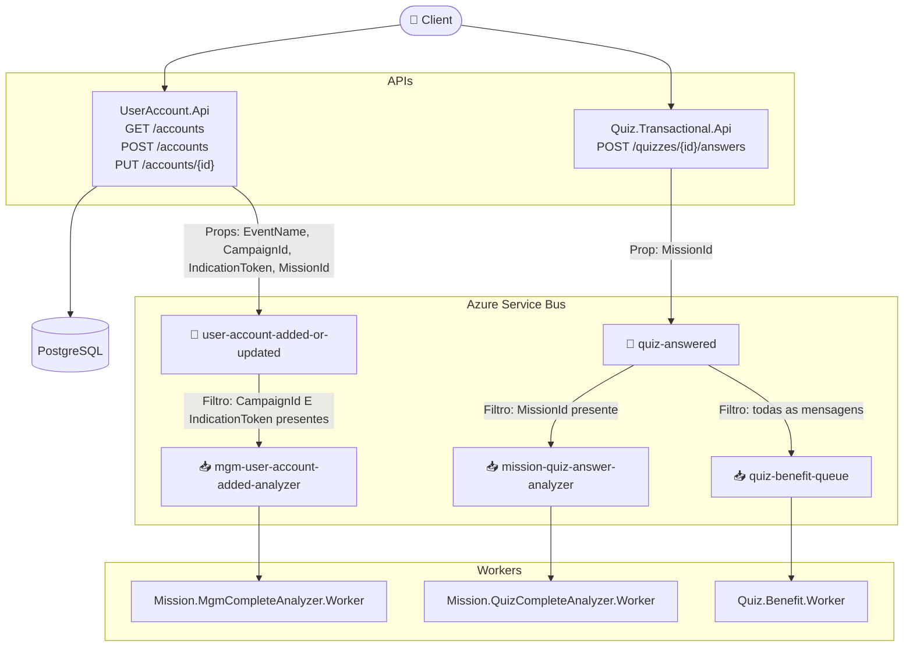

# AzureBrasilSummit2026

Solução de demonstração apresentada no **Azure Brasil Summit 2026**, ilustrando uma arquitetura orientada a eventos com ASP.NET Core Minimal API, Azure Service Bus e workers assíncronos em .NET 10.

O cenário simula uma plataforma de engajamento onde usuários respondem quizzes, completam missões e são indicados por outros participantes — tudo orquestrado de forma assíncrona e desacoplada via mensageria.

---

## Estrutura da Solução

```
AzureBrasilSummit2026/
├── src/
│   │
│   │   # Contexto: User Account
│   ├── UserAccount.Api/                      # API de contas (Minimal API + VSA + EF Core)
│   │
│   │   # Contexto: Mission
│   ├── Mission.Domain/                       # Domínio compartilhado do contexto de missões
│   ├── Mission.Infrastructure/               # Infraestrutura compartilhada do contexto de missões
│   ├── Mission.MgmCompleteAnalyzer.Worker/   # Worker: conclusão de missões MGM
│   ├── Mission.QuizCompleteAnalyzer.Worker/  # Worker: conclusão de missões Quiz
│   │
│   │   # Contexto: Quiz
│   ├── Quiz.Transactional.Api/               # API de quizzes (Minimal API + VSA)
│   └── Quiz.Benefit.Worker/                  # Worker: benefícios de quiz (scaffold)
│
├── docs/                                     # Diagramas e documentação técnica
└── AzureBrasilSummit2026.slnx
```

---

## Visão Geral da Arquitetura



---

## Projetos

### Contexto: User Account

#### `UserAccount.Api`
API responsável pelo gerenciamento de contas de usuário. Persiste os dados no PostgreSQL e publica eventos no tópico `user-account-added-or-updated`. Quando o payload contém `CampaignId` e `IndicationToken`, essas propriedades são adicionadas na mensagem para acionamento do fluxo MGM.

- **Endpoints:** `GET /accounts` · `POST /accounts` · `PUT /accounts/{id}`
- **Padrão:** Vertical Slice Architecture + Minimal API
- **Banco:** PostgreSQL via Entity Framework Core (coluna `jsonb` para `DataDictionary`)
- **Evento publicado:** `user-account-added-or-updated` com `EventName`, `CampaignId`, `IndicationToken` e `MissionId` nas `ApplicationProperties`

→ [README do projeto](src/UserAccount.Api/README.md)

---

### Contexto: Mission

#### `Mission.Domain`
Biblioteca de classes com as entidades e value objects do contexto de missões: `Mission`, `UserMission` e `IndicationToken`.

#### `Mission.Infrastructure`
Biblioteca de classes com repositórios in-memory e dados de seed: `MissionStore`, `UserMissionStore`, `IndicationTokenStore` e `SeedData`.

> `Mission.Domain` e `Mission.Infrastructure` são referenciados pelos dois workers abaixo.

#### `Mission.MgmCompleteAnalyzer.Worker`
Worker que consome a fila `mgm-user-account-added-analyzer`. Processa indicações de novos usuários e conclui missões MGM (Member Get Member) quando uma indicação válida é detectada via `CampaignId` e `IndicationToken`.

- **Fila:** `mgm-user-account-added-analyzer`
- **Origem:** tópico `user-account-added-or-updated` (filtrado por `CampaignId IS NOT NULL AND IndicationToken IS NOT NULL`)

→ [README do projeto](src/Mission.MgmCompleteAnalyzer.Worker/README.md)

#### `Mission.QuizCompleteAnalyzer.Worker`
Worker que consome a fila `mission-quiz-answer-analyzer`. Verifica se o usuário atingiu o score mínimo do quiz (`UserGotAward`) e, em caso positivo, conclui a missão Quiz associada ao `MissionId`.

- **Fila:** `mission-quiz-answer-analyzer`
- **Origem:** tópico `quiz-answered` (filtrado por `MissionId IS NOT NULL`)

→ [README do projeto](src/Mission.QuizCompleteAnalyzer.Worker/README.md)

---

### Contexto: Quiz

#### `Quiz.Transactional.Api`
API responsável por receber as respostas de um usuário para um quiz. Calcula o score, determina se o usuário atingiu o mínimo para prêmio e publica o resultado no tópico `quiz-answered`.

- **Endpoint:** `POST /quizzes/{id}/answers`
- **Padrão:** Vertical Slice Architecture + Minimal API
- **Evento publicado:** `quiz-answered` com `MissionId` nas `ApplicationProperties` (quando presente)

→ [README do projeto](src/Quiz.Transactional.Api/README.md)

#### `Quiz.Benefit.Worker`
Worker scaffold responsável por processar benefícios de gamificação para usuários que completaram quizzes. Implementação de lógica de negócio pendente.

- **Fila:** `quiz-benefit-queue`
- **Origem:** tópico `quiz-answered` (todas as mensagens)

→ [README do projeto](src/Quiz.Benefit.Worker/README.md)

---

## Tecnologias

| Tecnologia | Uso |
|---|---|
| .NET 10 | Plataforma base |
| ASP.NET Core Minimal API | APIs HTTP |
| Entity Framework Core + Npgsql | Persistência (UserAccount.Api) |
| Azure.Messaging.ServiceBus | Publicação e consumo de mensagens |
| Azure Service Bus (Topics + Queues) | Mensageria assíncrona com filtros |
| PostgreSQL | Banco de dados relacional |

---

## Padrões e Decisões de Design

| Padrão | Aplicado em |
|---|---|
| **Vertical Slice Architecture (VSA)** | `Quiz.Transactional.Api`, `UserAccount.Api` |
| **Minimal API** | Todas as APIs |
| **BackgroundService** | Todos os workers |
| **Message-driven Architecture** | Comunicação entre APIs e workers |
| **Dead-Letter** | Tratamento de mensagens inválidas nos workers |
| **Manual Message Settlement** | `AutoCompleteMessages = false` em todos os workers |
| **Application Properties como filtro** | Roteamento no Service Bus sem lógica adicional |

---

## Configuração

### 1. Infraestrutura Azure

Antes de executar a solução, é necessário provisionar os recursos Azure (Resource Group, Service Bus Namespace, tópicos, filas, assinaturas e filtros).

→ **[Guia completo de setup da infraestrutura Azure](docs/azure-setup.md)**

O guia cobre, passo a passo via Azure CLI:
- Criação do Resource Group e Service Bus Namespace
- Criação das 3 filas de destino
- Criação dos 2 tópicos
- Criação das 3 assinaturas com filtros SQL e forwarding automático para filas
- Como obter a connection string
- Comandos de verificação e limpeza

### 2. Configuração das Aplicações

Após provisionar a infraestrutura, atualize o `appsettings.json` (ou User Secrets) de cada projeto com os valores obtidos:

```json
{
  "ConnectionStrings": {
    "AzureServiceBus": "Endpoint=sb://sb-azbrsummit2026.servicebus.windows.net/;...",
    "PostgreSQL": "Host=localhost;Port=5432;Database=user_account_db;Username=postgres;Password=..."
  }
}
```

> Recomendado: utilize **Azure Key Vault** ou **User Secrets** em ambiente de desenvolvimento para não expor strings de conexão em código.

---

## Documentação Técnica

| Documento | Descrição |
|---|---|
| [Setup da Infraestrutura Azure](docs/azure-setup.md) | Passo a passo para criar todos os recursos Azure via CLI |
| [Arquitetura Geral](docs/architecture.md) | Diagrama de componentes e responsabilidades |
| [Topologia do Service Bus](docs/servicebus-topology.md) | Tópicos, assinaturas, filtros e filas |
| [Fluxo — Criar Conta](docs/flow-create-account.md) | Sequência completa do cadastro de usuário |
| [Fluxo — Responder Quiz](docs/flow-answer-quiz.md) | Sequência + cálculo de score |
| [Fluxo — Missão Quiz](docs/flow-mission-quiz-completion.md) | Conclusão de missão via worker |
| [Fluxo — Missão MGM](docs/flow-mission-mgm-completion.md) | Jornada completa de indicação MGM |
| [Referências e Recursos](docs/references.md) | Documentação oficial, tutoriais e conceitos-chave do Azure Service Bus |
