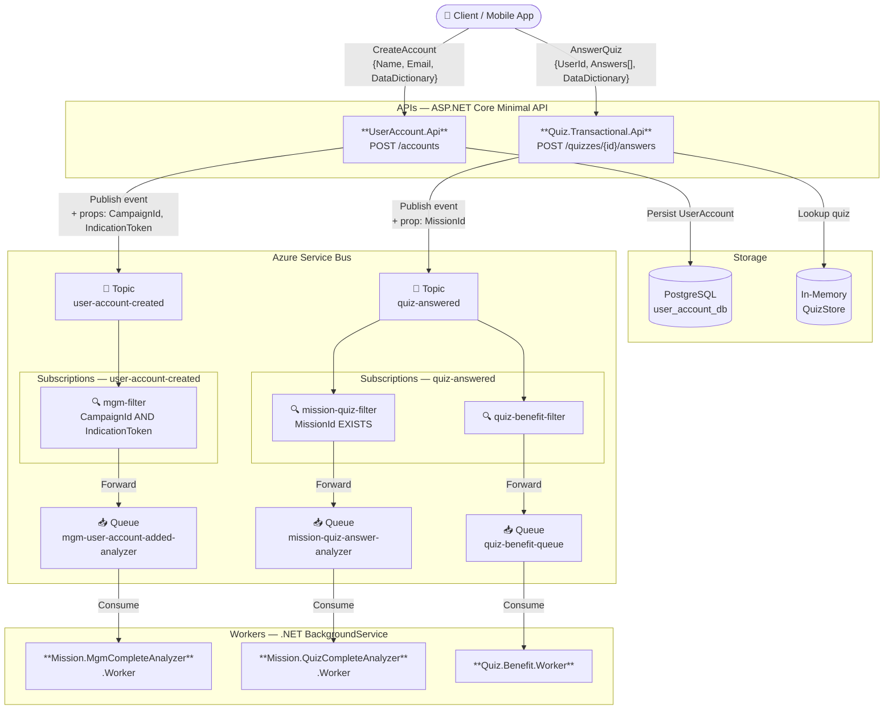

# Arquitetura do Sistema

## Visão Geral dos Componentes

## Responsabilidades por Camada

| Componente | Tipo | Responsabilidade Principal |
|---|---|---|
| `UserAccount.Api` | Minimal API | Cadastro de usuário + publicação de evento de conta criada |
| `Quiz.Transactional.Api` | Minimal API | Submissão de respostas + cálculo de score + publicação de resultado |
| `Mission.MgmCompleteAnalyzer.Worker` | Background Worker | Detecta indicações MGM e conclui missões Member-Get-Member |
| `Mission.QuizCompleteAnalyzer.Worker` | Background Worker | Detecta conclusão de quizzes com score mínimo e conclui missões Quiz |
| `Quiz.Benefit.Worker` | Background Worker | Processa benefícios (gamificação) para quizzes completados |
| Azure Service Bus | Mensageria | Desacoplamento assíncrono + roteamento por filtros de propriedades |
| PostgreSQL | Banco de dados | Persistência das contas de usuário |
