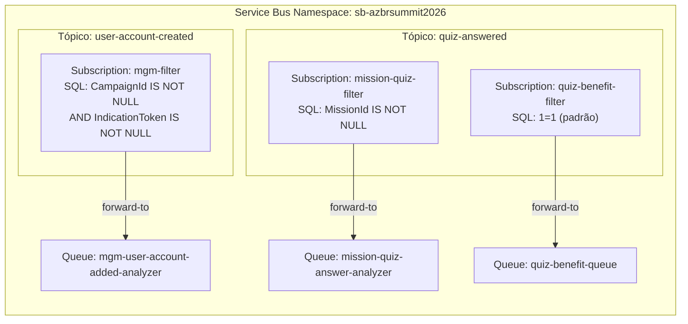

# Configuração da Infraestrutura Azure

Passo a passo para provisionar todos os recursos Azure necessários para executar a solução AzureBrasilSummit2026.

> Os comandos abaixo utilizam a **Azure CLI**. Certifique-se de estar autenticado com `az login` antes de executá-los.

---

## Pré-requisitos

- [Azure CLI](https://learn.microsoft.com/cli/azure/install-azure-cli) instalado e atualizado
- Conta Azure com permissão para criar recursos no subscription desejado
- Subscription ID disponível (`az account show --query id -o tsv`)

---

## 1. Variáveis de Ambiente

Defina as variáveis antes de executar os demais comandos. Ajuste os valores conforme seu ambiente.

```bash
# Identidade da solução
RESOURCE_GROUP="rg-azbrsummit2026"
LOCATION="brazilsouth"

# Service Bus
SB_NAMESPACE="sb-azbrsummit2026"  # deve ser globalmente único
SB_SKU="Standard"                 # Standard ou Premium (Topics exigem Standard+)

# Tópicos
TOPIC_USER_ACCOUNT="user-account-created"
TOPIC_QUIZ_ANSWERED="quiz-answered"

# Filas
QUEUE_MGM="mgm-user-account-added-analyzer"
QUEUE_MISSION_QUIZ="mission-quiz-answer-analyzer"
QUEUE_QUIZ_BENEFIT="quiz-benefit-queue"

# Assinaturas
SUB_MGM="mgm-filter"
SUB_MISSION_QUIZ="mission-quiz-filter"
SUB_QUIZ_BENEFIT="quiz-benefit-filter"
```

---

## 2. Resource Group

```bash
az group create \
  --name $RESOURCE_GROUP \
  --location $LOCATION
```

---

## 3. Service Bus Namespace

```bash
az servicebus namespace create \
  --name $SB_NAMESPACE \
  --resource-group $RESOURCE_GROUP \
  --location $LOCATION \
  --sku $SB_SKU
```

> **Atenção:** O SKU `Standard` é o mínimo necessário para utilizar **Topics** e **Subscriptions**. O SKU `Basic` suporta apenas filas simples.

---

## 4. Filas

As filas recebem as mensagens encaminhadas pelas assinaturas dos tópicos via forwarding.

```bash
# Fila para missões MGM
az servicebus queue create \
  --name $QUEUE_MGM \
  --resource-group $RESOURCE_GROUP \
  --namespace-name $SB_NAMESPACE \
  --max-delivery-count 5 \
  --enable-dead-lettering-on-message-expiration true

# Fila para análise de missões Quiz
az servicebus queue create \
  --name $QUEUE_MISSION_QUIZ \
  --resource-group $RESOURCE_GROUP \
  --namespace-name $SB_NAMESPACE \
  --max-delivery-count 5 \
  --enable-dead-lettering-on-message-expiration true

# Fila para benefícios de quiz
az servicebus queue create \
  --name $QUEUE_QUIZ_BENEFIT \
  --resource-group $RESOURCE_GROUP \
  --namespace-name $SB_NAMESPACE \
  --max-delivery-count 5 \
  --enable-dead-lettering-on-message-expiration true
```

---

## 5. Tópicos

```bash
# Tópico: user-account-created (publicado pela UserAccount.Api)
az servicebus topic create \
  --name $TOPIC_USER_ACCOUNT \
  --resource-group $RESOURCE_GROUP \
  --namespace-name $SB_NAMESPACE \
  --max-size 1024

# Tópico: quiz-answered (publicado pela Quiz.Transactional.Api)
az servicebus topic create \
  --name $TOPIC_QUIZ_ANSWERED \
  --resource-group $RESOURCE_GROUP \
  --namespace-name $SB_NAMESPACE \
  --max-size 1024
```

---

## 6. Assinaturas e Filtros

Cada assinatura possui um filtro SQL que inspeciona as `ApplicationProperties` da mensagem e encaminha apenas as mensagens elegíveis para a fila correspondente.

> As assinaturas são criadas com `--forward-to` para que as mensagens sejam automaticamente movidas para as filas configuradas. O forwarding dentro do mesmo namespace não requer permissões adicionais.

### 6.1 Tópico `user-account-created`

#### Assinatura `mgm-filter`
Encaminha mensagens que possuem **ambas** as propriedades `CampaignId` e `IndicationToken`.

```bash
# Criar assinatura com forwarding para a fila MGM
az servicebus topic subscription create \
  --name $SUB_MGM \
  --resource-group $RESOURCE_GROUP \
  --namespace-name $SB_NAMESPACE \
  --topic-name $TOPIC_USER_ACCOUNT \
  --forward-to $QUEUE_MGM \
  --max-delivery-count 5 \
  --enable-dead-lettering-on-message-expiration true

# Remover o filtro padrão (TrueFilter — aceita tudo)
az servicebus topic subscription rule delete \
  --name "\$Default" \
  --resource-group $RESOURCE_GROUP \
  --namespace-name $SB_NAMESPACE \
  --topic-name $TOPIC_USER_ACCOUNT \
  --subscription-name $SUB_MGM

# Criar o filtro SQL: somente mensagens com CampaignId E IndicationToken
az servicebus topic subscription rule create \
  --name "mgm-sql-filter" \
  --resource-group $RESOURCE_GROUP \
  --namespace-name $SB_NAMESPACE \
  --topic-name $TOPIC_USER_ACCOUNT \
  --subscription-name $SUB_MGM \
  --filter-sql-expression "CampaignId IS NOT NULL AND IndicationToken IS NOT NULL"
```

---

### 6.2 Tópico `quiz-answered`

#### Assinatura `mission-quiz-filter`
Encaminha mensagens que possuem a propriedade `MissionId`.

```bash
# Criar assinatura com forwarding para a fila de missões quiz
az servicebus topic subscription create \
  --name $SUB_MISSION_QUIZ \
  --resource-group $RESOURCE_GROUP \
  --namespace-name $SB_NAMESPACE \
  --topic-name $TOPIC_QUIZ_ANSWERED \
  --forward-to $QUEUE_MISSION_QUIZ \
  --max-delivery-count 5 \
  --enable-dead-lettering-on-message-expiration true

# Remover o filtro padrão
az servicebus topic subscription rule delete \
  --name "\$Default" \
  --resource-group $RESOURCE_GROUP \
  --namespace-name $SB_NAMESPACE \
  --topic-name $TOPIC_QUIZ_ANSWERED \
  --subscription-name $SUB_MISSION_QUIZ

# Criar o filtro SQL: somente mensagens com MissionId
az servicebus topic subscription rule create \
  --name "mission-quiz-sql-filter" \
  --resource-group $RESOURCE_GROUP \
  --namespace-name $SB_NAMESPACE \
  --topic-name $TOPIC_QUIZ_ANSWERED \
  --subscription-name $SUB_MISSION_QUIZ \
  --filter-sql-expression "MissionId IS NOT NULL"
```

#### Assinatura `quiz-benefit-filter`
Encaminha **todas** as mensagens do tópico (sem restrição de propriedades).

```bash
# Criar assinatura com forwarding para a fila de benefícios
az servicebus topic subscription create \
  --name $SUB_QUIZ_BENEFIT \
  --resource-group $RESOURCE_GROUP \
  --namespace-name $SB_NAMESPACE \
  --topic-name $TOPIC_QUIZ_ANSWERED \
  --forward-to $QUEUE_QUIZ_BENEFIT \
  --max-delivery-count 5 \
  --enable-dead-lettering-on-message-expiration true

# O filtro padrão (TrueFilter / 1=1) já aceita todas as mensagens.
# Nenhuma alteração de regra necessária.
```

---

## 7. Obter a Connection String

```bash
az servicebus namespace authorization-rule keys list \
  --name "RootManageSharedAccessKey" \
  --resource-group $RESOURCE_GROUP \
  --namespace-name $SB_NAMESPACE \
  --query primaryConnectionString \
  --output tsv
```

Copie o valor retornado e atualize o `appsettings.json` (ou User Secrets) de cada projeto:

```json
{
  "ConnectionStrings": {
    "AzureServiceBus": "<connection-string-aqui>"
  }
}
```

> **Recomendação de segurança:** em produção, use uma **Shared Access Policy** com permissões mínimas por componente (Send para APIs, Listen para Workers) em vez de usar a `RootManageSharedAccessKey`.

---

## 8. Verificação

Confirme que todos os recursos foram criados corretamente:

```bash
# Listar filas
az servicebus queue list \
  --resource-group $RESOURCE_GROUP \
  --namespace-name $SB_NAMESPACE \
  --query "[].name" -o table

# Listar tópicos
az servicebus topic list \
  --resource-group $RESOURCE_GROUP \
  --namespace-name $SB_NAMESPACE \
  --query "[].name" -o table

# Listar assinaturas do tópico user-account-created
az servicebus topic subscription list \
  --resource-group $RESOURCE_GROUP \
  --namespace-name $SB_NAMESPACE \
  --topic-name $TOPIC_USER_ACCOUNT \
  --query "[].{Name:name, ForwardTo:forwardTo}" -o table

# Listar assinaturas do tópico quiz-answered
az servicebus topic subscription list \
  --resource-group $RESOURCE_GROUP \
  --namespace-name $SB_NAMESPACE \
  --topic-name $TOPIC_QUIZ_ANSWERED \
  --query "[].{Name:name, ForwardTo:forwardTo}" -o table

# Verificar regras de filtro da assinatura mgm-filter
az servicebus topic subscription rule list \
  --resource-group $RESOURCE_GROUP \
  --namespace-name $SB_NAMESPACE \
  --topic-name $TOPIC_USER_ACCOUNT \
  --subscription-name $SUB_MGM \
  --query "[].{Name:name, Filter:sqlFilter.sqlExpression}" -o table

# Verificar regras de filtro da assinatura mission-quiz-filter
az servicebus topic subscription rule list \
  --resource-group $RESOURCE_GROUP \
  --namespace-name $SB_NAMESPACE \
  --topic-name $TOPIC_QUIZ_ANSWERED \
  --subscription-name $SUB_MISSION_QUIZ \
  --query "[].{Name:name, Filter:sqlFilter.sqlExpression}" -o table
```

**Saída esperada das filas:**

| Name |
|---|
| mgm-user-account-added-analyzer |
| mission-quiz-answer-analyzer |
| quiz-benefit-queue |

**Saída esperada dos tópicos:**

| Name |
|---|
| user-account-created |
| quiz-answered |

**Saída esperada das assinaturas com forwarding:**

| Name | ForwardTo |
|---|---|
| mgm-filter | mgm-user-account-added-analyzer |
| mission-quiz-filter | mission-quiz-answer-analyzer |
| quiz-benefit-filter | quiz-benefit-queue |

---

## 9. Resumo da Topologia



---

## 10. Limpeza dos Recursos

Para remover todos os recursos criados e evitar cobranças:

```bash
az group delete \
  --name $RESOURCE_GROUP \
  --yes \
  --no-wait
```
