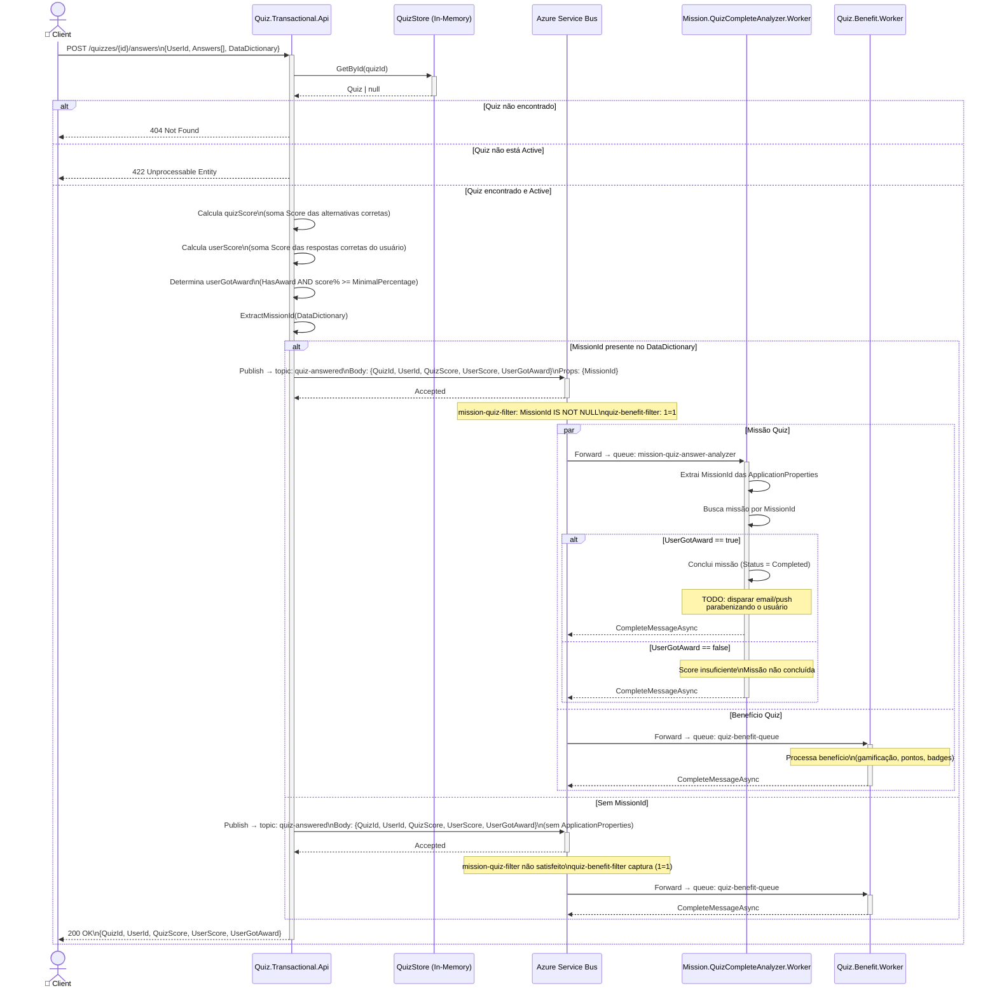
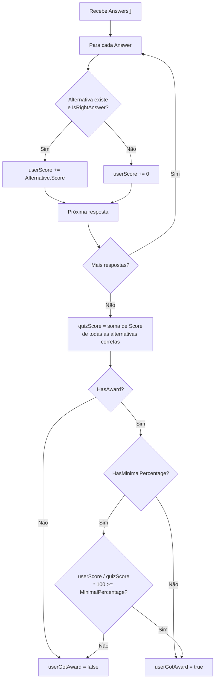

# Fluxo — Resposta de Quiz

## Sequência Completa

## Cálculo de Score

## Cenários

| Cenário | `userGotAward` | Worker de missão |
|---|---|---|
| Score abaixo do mínimo | `false` | Missão permanece `Active` |
| Score acima do mínimo + `HasAward = true` | `true` | Missão → `Completed` |
| Quiz sem `HasAward` | `false` | Missão permanece `Active` |
| Sem `MissionId` no payload | — | `Mission.QuizCompleteAnalyzer` não é acionado |
