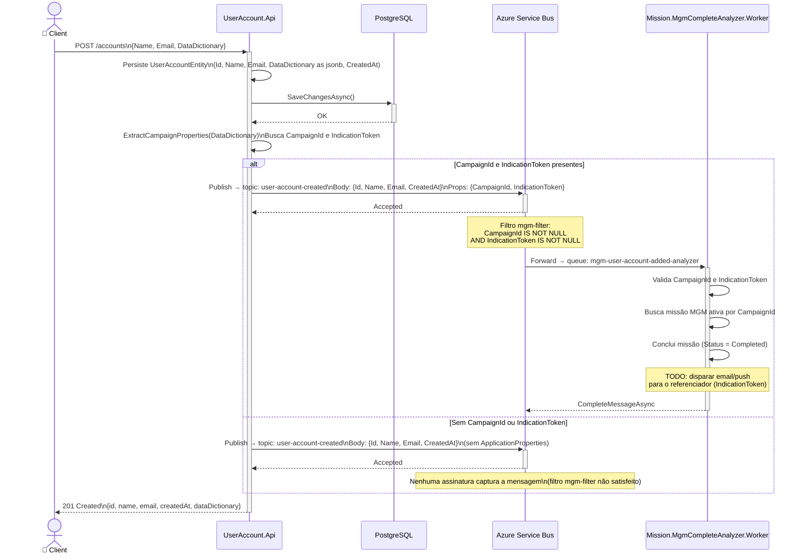

# Fluxo — Criação de Conta de Usuário

## Sequência Completa

## Cenários

| Cenário | Resultado |
|---|---|
| `DataDictionary` sem `CampaignId`/`IndicationToken` | Conta criada, evento publicado sem properties, nenhum worker processa |
| `DataDictionary` com ambas as propriedades | Conta criada + missão MGM concluída pelo worker |
| Falha na persistência no PostgreSQL | Retorna `500`, nenhum evento publicado |
