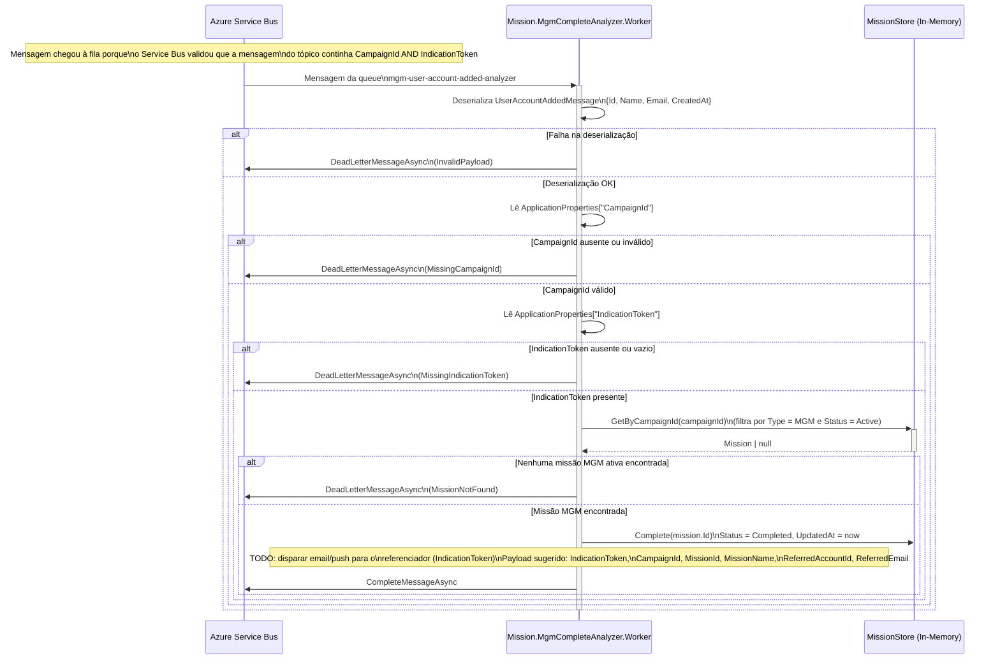
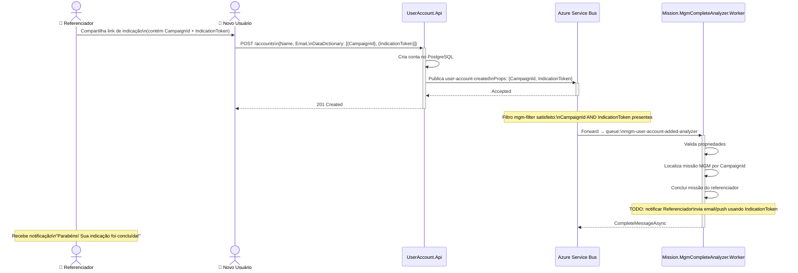

# Fluxo — Conclusão de Missão MGM (Member Get Member)

## Sequência do Worker

```mermaid
sequenceDiagram
    participant SB as Azure Service Bus
    participant W as Mission.MgmCompleteAnalyzer.Worker
    participant MS as MissionStore (In-Memory)

    Note over SB: Mensagem chegou à fila porque\no Service Bus validou que a mensagem\ndo tópico continha CampaignId AND IndicationToken

    SB->>+W: Mensagem da queue\nmgm-user-account-added-analyzer

    W->>W: Deserializa UserAccountAddedMessage\n{Id, Name, Email, CreatedAt}

    alt Falha na deserialização
        W->>SB: DeadLetterMessageAsync\n(InvalidPayload)
    else Deserialização OK
        W->>W: Lê ApplicationProperties["CampaignId"]

        alt CampaignId ausente ou inválido
            W->>SB: DeadLetterMessageAsync\n(MissingCampaignId)
        else CampaignId válido
            W->>W: Lê ApplicationProperties["IndicationToken"]

            alt IndicationToken ausente ou vazio
                W->>SB: DeadLetterMessageAsync\n(MissingIndicationToken)
            else IndicationToken presente
                W->>+MS: GetByCampaignId(campaignId)\n(filtra por Type = MGM e Status = Active)
                MS-->>-W: Mission | null

                alt Nenhuma missão MGM ativa encontrada
                    W->>SB: DeadLetterMessageAsync\n(MissionNotFound)
                else Missão MGM encontrada
                    W->>MS: Complete(mission.Id)\nStatus = Completed, UpdatedAt = now
                    Note over W: TODO: disparar email/push para o\nreferenciador (IndicationToken)\nPayload sugerido: IndicationToken,\nCampaignId, MissionId, MissionName,\nReferredAccountId, ReferredEmail
                    W->>SB: CompleteMessageAsync
                end
            end
        end
    end
    deactivate W
```

## Jornada Completa da Indicação MGM

```mermaid
sequenceDiagram
    actor Referrer as 👤 Referenciador
    actor NewUser as 👤 Novo Usuário
    participant API as UserAccount.Api
    participant SB as Azure Service Bus
    participant W as Mission.MgmCompleteAnalyzer.Worker

    Referrer->>NewUser: Compartilha link de indicação\n(contém CampaignId + IndicationToken)

    NewUser->>+API: POST /accounts\n{Name, Email,\nDataDictionary: [{CampaignId}, {IndicationToken}]}

    API->>API: Cria conta no PostgreSQL
    API->>+SB: Publica user-account-created\nProps: {CampaignId, IndicationToken}
    SB-->>-API: Accepted
    API-->>-NewUser: 201 Created

    Note over SB: Filtro mgm-filter satisfeito:\nCampaignId AND IndicationToken presentes

    SB->>+W: Forward → queue:\nmgm-user-account-added-analyzer
    W->>W: Valida propriedades
    W->>W: Localiza missão MGM por CampaignId
    W->>W: Conclui missão do referenciador
    Note over W: TODO: notificar Referenciador\nvia email/push usando IndicationToken
    W-->>-SB: CompleteMessageAsync

    Note over Referrer: Recebe notificação\n"Parabéns! Sua indicação foi concluída!"
```
