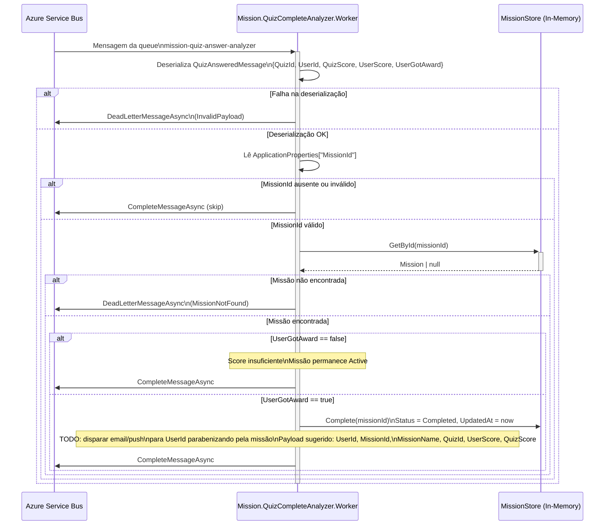
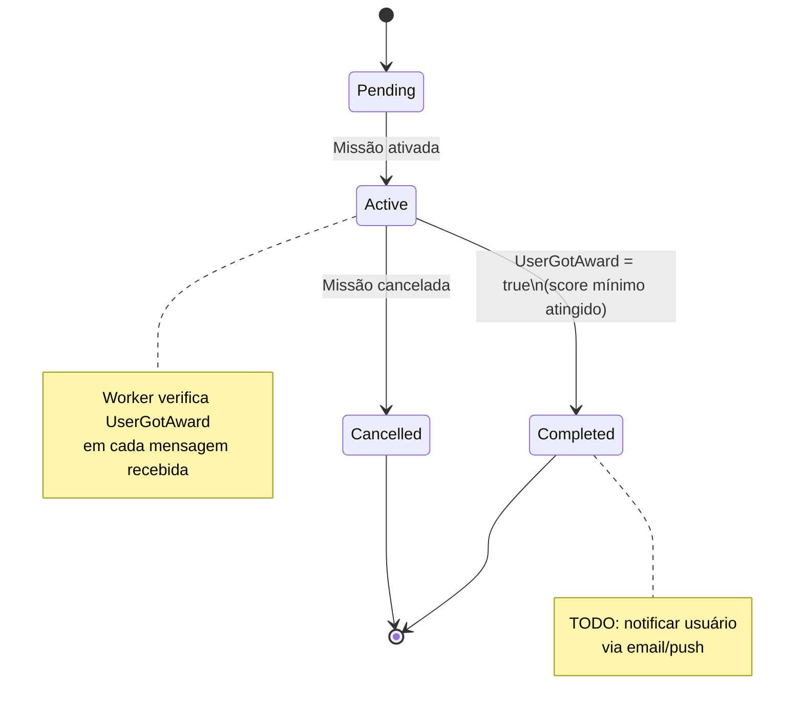

# Fluxo — Conclusão de Missão Quiz

## Sequência do Worker

```mermaid
sequenceDiagram
    participant SB as Azure Service Bus
    participant W as Mission.QuizCompleteAnalyzer.Worker
    participant MS as MissionStore (In-Memory)

    SB->>+W: Mensagem da queue\nmission-quiz-answer-analyzer

    W->>W: Deserializa QuizAnsweredMessage\n{QuizId, UserId, QuizScore, UserScore, UserGotAward}

    alt Falha na deserialização
        W->>SB: DeadLetterMessageAsync\n(InvalidPayload)
    else Deserialização OK
        W->>W: Lê ApplicationProperties["MissionId"]

        alt MissionId ausente ou inválido
            W->>SB: CompleteMessageAsync (skip)
        else MissionId válido
            W->>+MS: GetById(missionId)
            MS-->>-W: Mission | null

            alt Missão não encontrada
                W->>SB: DeadLetterMessageAsync\n(MissionNotFound)
            else Missão encontrada
                alt UserGotAward == false
                    Note over W: Score insuficiente\nMissão permanece Active
                    W->>SB: CompleteMessageAsync
                else UserGotAward == true
                    W->>MS: Complete(missionId)\nStatus = Completed, UpdatedAt = now
                    Note over W: TODO: disparar email/push\npara UserId parabenizando pela missão\nPayload sugerido: UserId, MissionId,\nMissionName, QuizId, UserScore, QuizScore
                    W->>SB: CompleteMessageAsync
                end
            end
        end
    end
    deactivate W
```

## Diagrama de Estados da Missão

```mermaid
stateDiagram-v2
    [*] --> Pending
    Pending --> Active : Missão ativada
    Active --> Completed : UserGotAward = true\n(score mínimo atingido)
    Active --> Cancelled : Missão cancelada
    Completed --> [*]
    Cancelled --> [*]

    note right of Active
        Worker verifica UserGotAward
        em cada mensagem recebida
    end note

    note right of Completed
        TODO: notificar usuário
        via email/push
    end note
```
