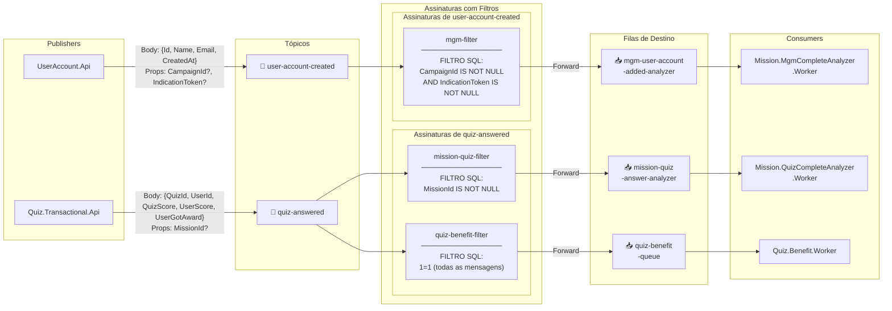

# Topologia do Azure Service Bus

## Diagrama de Tópicos, Assinaturas e Filas

## Propriedades das Mensagens por Tópico

### Tópico `user-account-created`

| Propriedade | Tipo | Quando presente | Usado por |
|---|---|---|---|
| `CampaignId` | `Guid` | Quando o `DataDictionary` contém `CampaignId` | Filtro `mgm-filter` |
| `IndicationToken` | `string` | Quando o `DataDictionary` contém `IndicationToken` | Filtro `mgm-filter` |

> **Regra de negócio:** Apenas mensagens com **ambas** as propriedades (`CampaignId` AND `IndicationToken`) são encaminhadas para a fila MGM.

### Tópico `quiz-answered`

| Propriedade | Tipo | Quando presente | Usado por |
|---|---|---|---|
| `MissionId` | `Guid` | Quando o `DataDictionary` contém `MissionId` | Filtro `mission-quiz-filter` |

> **Regra de negócio:** Mensagens sem `MissionId` ainda chegam ao `Quiz.Benefit.Worker` (filtro `1=1`), mas são ignoradas pelo `Mission.QuizCompleteAnalyzer.Worker`.

## Settlement de Mensagens

Todos os workers utilizam `AutoCompleteMessages = false` e fazem o settlement explícito:

| Situação | Ação |
|---|---|
| Processamento bem-sucedido | `CompleteMessageAsync` |
| Payload inválido / não deserializável | `DeadLetterMessageAsync` |
| Entidade não encontrada | `DeadLetterMessageAsync` |
| Skip intencional (ex: score insuficiente) | `CompleteMessageAsync` |
